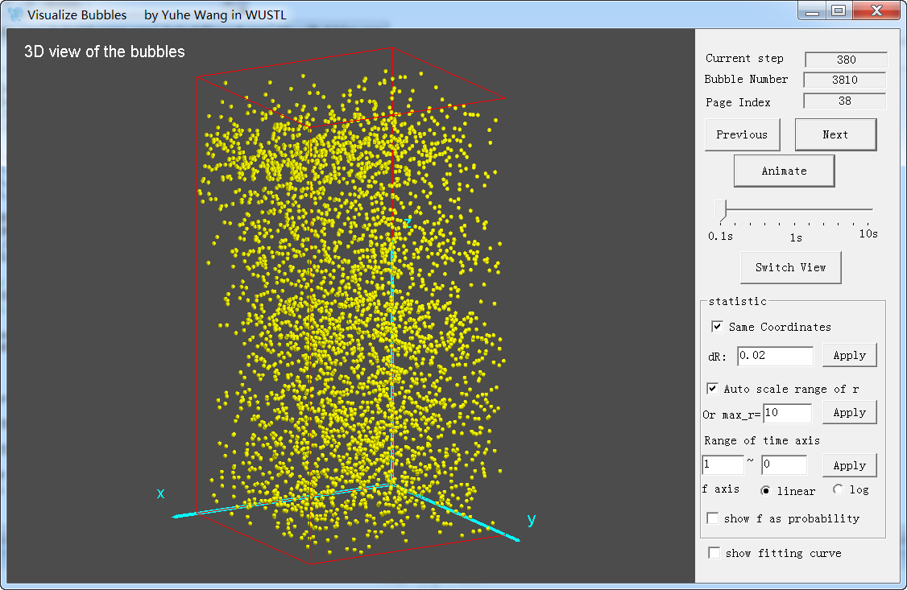

# Bubble
The project bubble is a tool that simulates that the coagulation process of escaping bubbles. Please see the details in the attached paper.

# Papers
- [Coagulation Process of Escaping Bubbles and Parallel Simulation](bubble.pdf)